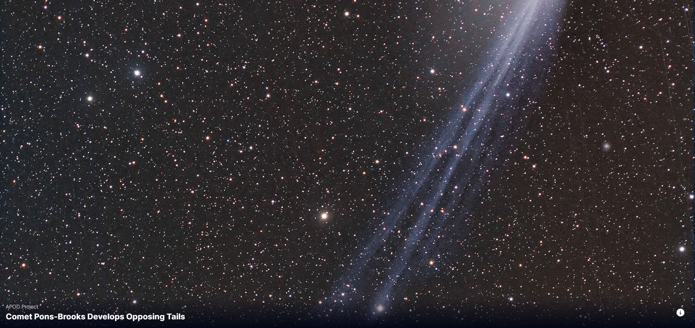

# [NASA APOD Viewer](https://space-it-up.netlify.app/)

This project is a simple React application that fetches and displays the NASA Astronomy Picture of the Day (APOD). The app also includes a sidebar and a footer component that can toggle visibility based on user interaction.

## Table of Contents

-   [Installation](#installation)
-   [Usage](#usage)
-   [Environment Variables](#environment-variables)
-   [Dependencies](#dependencies)

## Installation

1. Clone the repository:

    ```bash
    git clone https://github.com/your-username/nasa-apod-viewer.git
    cd nasa-apod-viewer
    ```

2. Install the dependencies:

    ```bash
    npm install
    ```

3. Create a `.env` file in the root of the project and add your NASA API key:

    ```env
    VITE_NASA_API_KEY=your_nasa_api_key
    ```

4. Start the development server:
    ```bash
    npm run dev
    ```

## Usage

Once the server is running, open your browser and navigate to `http://localhost:5173` to view the app. The application will fetch the NASA Astronomy Picture of the Day and display it along with a title and description.

## Environment Variables

The application requires a NASA API key to fetch the APOD data. This key should be stored in a `.env` file in the root of the project.

```env
VITE_NASA_API_KEY=your_nasa_api_key
```

## Dependencies

-   React
-   Vite
-   Font Awesome (for icons)

To install these dependencies, you can use `npm install` as described in the [Installation](#installation) section.


